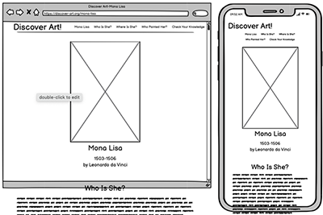
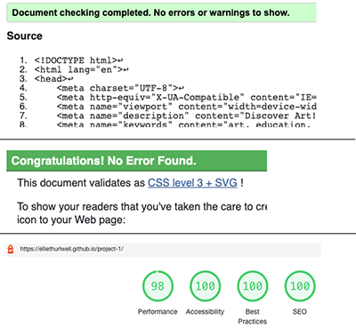

<h1 align="center">Discover Art! Mona Lisa</h1>

This is the Discover Art! page for Mona Lisa by Leonardo da Vinci. It is designed to be an educational site for children and a resource for parents and/or teachers to assits in early art education.

[View the live project here.](https://elliethurlwell.github.io/project1-discoverart/index.html)

<h2 align="center"></h2>

## User Experience (UX)

-   ### User stories

    -   #### First Time Visitor Goals

        1. As a First Time Visitor, I want to be able to view the artwork this page is focused on.
        2. As a First Time Visitor, I want to be able to easily navigate throughout the site to discover all the different information provided.
        3. As a First Time Visitor, I want to be able to learn something without it requiring a lot of effort.

    -   #### Returning Visitor Goals

        1. As a Returning Visitor, I want to delve deeper into the information and spend time on the site.
        2. As a Returning Visitor, I want to be prompted to engage with the site.
        3. As a Returning Visitor, I want to be able to move my learning forward with more resources provided or recommended.
        4. As a Returning Visitor, I want to find community links.

-   ### Design
    -   #### Colour Scheme
        -   The main colours used across the site are the primary colours red, blue and yellow. The colours of the heading elements are a dark purple colour (#330033) and all other text is a dark green (#001400), both found in the painting Mona Lisa.
    -   #### Typography
        -   Montserrat is the main font used throughout the website with Sans Serif as the fallback font. Montserrat is clean and easy to read, appropriate for a younger target audience. The line spacing applied increases this ease. Gloria Hallelujah is the font for all headings with Cursive as the fallback font. It has fun and childlike characteristics and resembles handwriting, making it appropriate for the subject matter.
    -   #### Imagery
        -   Imagery is key for the purpose of this website. When initially loaded the main image of Mona Lisa is positioned centrally with no distractions, clearly illustrating the focus of the site. More images appear alongside the relevant text content which provides some visual learning and breaks up the content. 
        -   The paint splatter design of the Discover Art! logo continues throughout the page in the background of all headings. This adds visual consistency and a coherent identity. 

*   ### Wireframes

    -   Home Page Wireframe for desktop and mobile view, with suggestion of scrollable content.
    <h2 align="center"></h2>

## Features

-   Responsive across a variety of screen sizes

-   Interactive elements

-   Downloadable content

## Technologies Used

### Languages Used

-   [HTML5](https://en.wikipedia.org/wiki/HTML5)
-   [CSS3](https://en.wikipedia.org/wiki/Cascading_Style_Sheets)

### Frameworks, Libraries & Programs Used

- [Google Fonts:](https://fonts.google.com/)
    - Google fonts were used to import the 'Gloria Hallelujah' and 'Montserrat" fonts into the style.css file.
- [Font Awesome:](https://fontawesome.com/)
    - Font Awesome was used to add social media icons to the footer.
- [W3Schools](https://www.w3schools.com/)
    - W3Schools tutorials were used to create responsive mobile navigation and modal box.
- [Git](https://git-scm.com/)
    - Git was used for version control by utilizing the Gitpod terminal to commit to Git and Push to GitHub.
- [GitHub:](https://github.com/)
    - GitHub is used to store the projects code after being pushed from Git.
- [Photoshop:](https://www.adobe.com/ie/products/photoshop.html)
    - Photoshop was used to create the logo and icon, heading backgrounds, pdf worksheet, and to resize images.
- [Balsamiq:](https://balsamiq.com/)
    - Balsamiq was used to create the wireframes during the design process.

## Testing

The W3C Markup Validator and W3C CSS Validator Services were used to validate every page of the project to ensure there were no syntax errors in the project.

-   [W3C Markup Validator](https://jigsaw.w3.org/css-validator/#validate_by_input) - no errors
-   [W3C CSS Validator](https://jigsaw.w3.org/css-validator/#validate_by_input) - no errors
-   [Lighthouse](https://developers.google.com/web/tools/lighthouse) - Performance: 98, Accessibility: 100, Best Practices: 100, SEO: 100.
<h2 align="center"></h2>

### Testing User Stories from User Experience (UX) Section

-   #### First Time Visitor Goals

    1. As a First Time Visitor, I want to be able to view the artwork this page is focused on.

        - Upon entering the site, users are greeted with a clear, good quality image of the painting Mona Lisa. 
        - The heading and paragraph below identify the image in a clear and straightforward manner.
    <h2 align="center"></h2>

    2. As a First Time Visitor, I want to be able to easily navigate throughout the site to discover all the different information provided.

        - The site header clearly displays the navigation links to the different sections of the site. They have hover over styling to catch the users attention.
        - The website is a single page site to allow the user to scroll and explore the content. 
        - When hovered over, the background colour of the navigation links correspond to the background graphic of that section's heading. 
    <h2 align="center"></h2>

    3. As a First Time Visitor, I want to be able to learn something without it requiring a lot of effort.

        - The content is broken down into sections and further separated into easy to digest chunks of information.
        - Bullet point lists allow facts to be visible and stand out on the page.
    <h2 align="center"></h2>

-   #### Returning Visitor Goals

    1. As a Returning Visitor, I want to delve deeper into the information and spend time on the site.

        - All information is clearly laid out so the user can easily navegate to what interests them most.
        - The scrolling nature of the site makes it easy to move between and compare facts from different sections, however the user decides. 
    <h2 align="center"></h2>

    2. As a Returning Visitor, I want to be prompted to engage with the site.

        - The 'Check Your Knowledge' section is so named to prompt the user to engage with the content.
        - It contains a short quiz in which the user can select one answer and then view the correct answers.
        - The 'Check Answers' button has a hover over background colour to catch the user's attention.
        - In the 'Where Is She?' section the user is prompted to zoom out on the embedded map.
    <h2 align="center"></h2>

    3. As a Returning Visitor, I want to be able to move my learning forward with more resources provided or recommended.

        - The user is prompted to try a colouring worksheet after the quiz. This is in the form of a pdf which opens in a new tab and which they are able to download and/or print. 
        - The text in the footer reminds the user of the other lessons and resources they provide.
    <h2 align="center"></h2>

    4. As a Returning Visitor, I want to find community links.

        - The footer contains icon links to social media channels for Discover Art!
        - These links have the same hover over styling as the navegation links which makes them familiar and understanable for the user.
    <h2 align="center"></h2>

### Further Testing

-   The Website was tested on Google Chrome and Safari browsers on both desktop and mobile, and Firefox, Microsoft Edge and Internet Explorer on desktop.
-   The website was viewed on a variety of devices including MacBook, laptop, iPad, iPhone 7 plus, iPhone 12 mini, Samsung Galaxy Note8 and Huawei P20.
-   Friends and family members were asked to review the site to point out any issues. 
-   Two friends with both art and teaching backgrounds were asked to review the site and responded that the content is relevant and well structured for the intended audience and purpose. 

### Bugs

-   Pages and linked sections begin at the top of the viewport and are therefore hidden behind the fixed header.
    - fixed by creating the section-padding class and setting it's size to clear the header.
-   When completing the form element and clicking the 'Check Answers' button for the first time the site reloads. Any time after this the button correctly displays the modal box.
    - fixed by wrapping the button in a parent div.
-   Image in 'Where Is She?' section becomes distorted on iPad screensize.
    - fixed by moving it's css rule into the media query for the previous size of screen.
-   Positioning of one image and the form are shifted on Internet Explorer. louvre-crowd.jpg is pushed all the way to the right and the fieldsets in the form overlap each other.
    - not fixed - works correct in all other browsers tested.

## Deployment

### GitHub Pages

The project was deployed to GitHub Pages using the following steps:

1. Log in to GitHub and locate the [GitHub Repository](https://github.com/EllieThurlwell/project1-discoverart)
2. At the top of the Repository (not top of page), locate the "Settings" Button on the menu.
3. On the lefthand menu locate the "Pages" button.
4. Under "Source", click the dropdown called "None" and select "Master Branch". Click "Save".
5. The page will automatically refresh and provide a link to the [published site](https://elliethurlwell.github.io/project1-discoverart/).

## Credits

### Code

-   Gitpod workspace came from this Code Institute [template](https://github.com/Code-Institute-Org/gitpod-full-template).
-   Layout of README file came from this Code Institute [sample](https://github.com/Code-Institute-Solutions/SampleREADME).
-   The code for the responsive mobile navigation came from this W3Schools [Responsive Top Navigation](https://www.w3schools.com/howto/howto_js_topnav_responsive.asp) tutorial.
-   The code for the 'Check Answers' button came from this W3Schools [Modal Box](https://www.w3schools.com/howto/howto_css_modals.asp) tutorial.

### Content

-   All content was written by the developer.

-   Research was carried out on these sites
    -   https://kids.kiddle.co/Leonardo_da_Vinci
    -   https://kids.kiddle.co/Mona_Lisa
    -   https://www.mentalfloss.com/article/62280/14-things-you-didnt-know-about-mona-lisa
    -   https://www.leonardodavinci.net/the-mona-lisa.jsp
    -   https://www.britannica.com/topic/Mona-Lisa-painting/The-Mona-Lisa-and-its-influence
    -   https://kidzfeed.com/mona-lisa-facts-for-kids/

### Media

-   The usage terms of all images is either Public Domain or Creative Commons Attribution - Share Alike 4.0.
-   The frame for the images was purchased from [iStock](https://www.istockphoto.com/es/foto/amplio-marco-de-oro-gm162714310-23165337)
-   All logos and graphics were created by the developed.
-   The pdf worksheet was created by the developer.